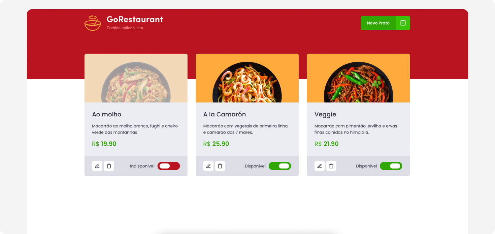

# Go Restaurant App - Exercise 5 from Ignite

Performed tasks:

- Refactor the code using functional components instead of class components
- Use React hooks useState and useEffect instead of class-based methods for managing state and side effects
- Write type and interface definitions for components and data consumed via API

 

## Project screenshot

